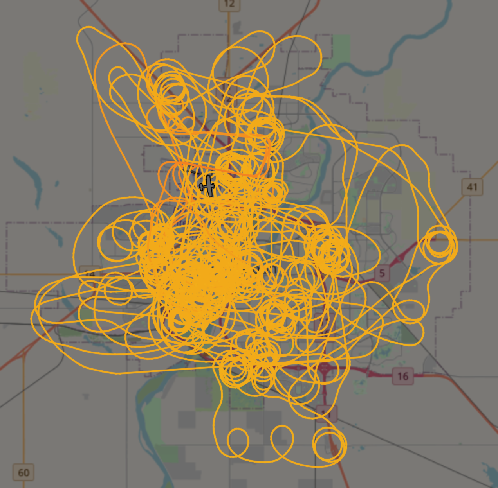
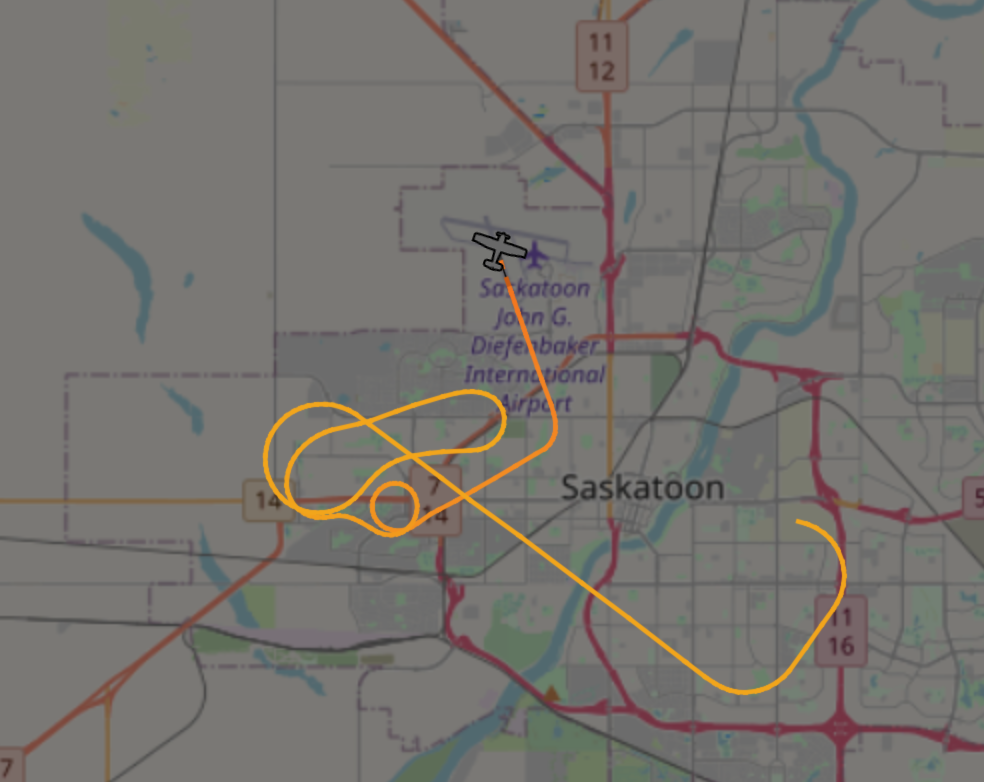
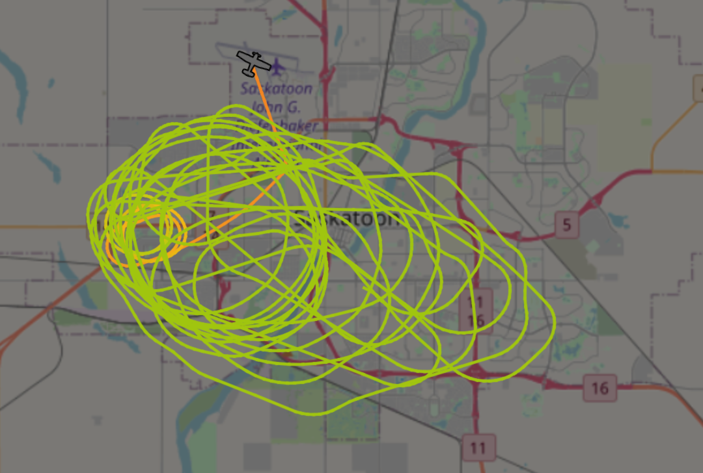
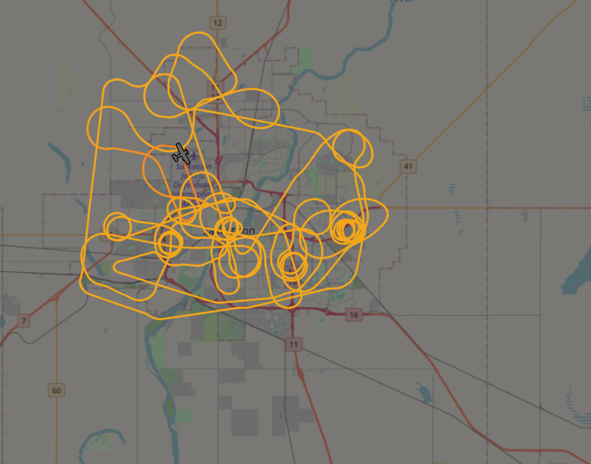
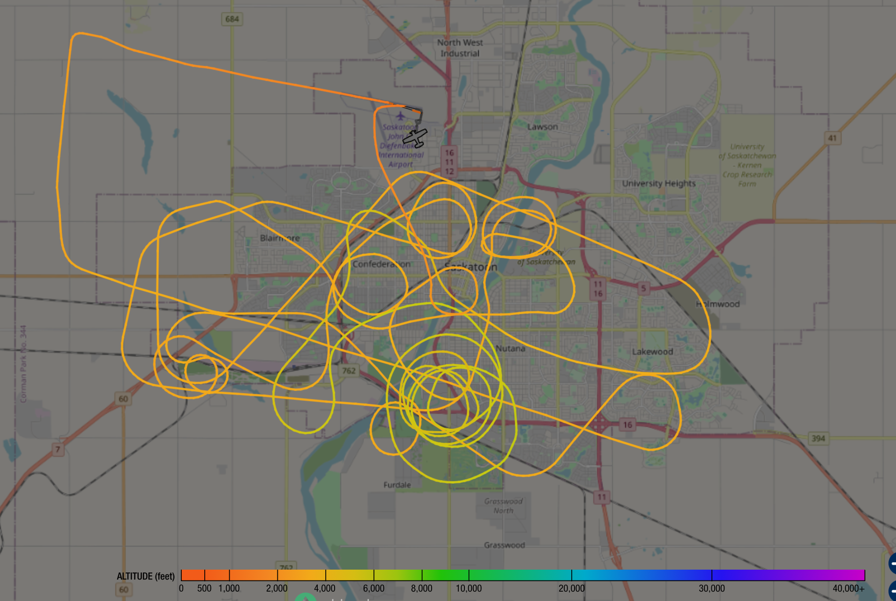
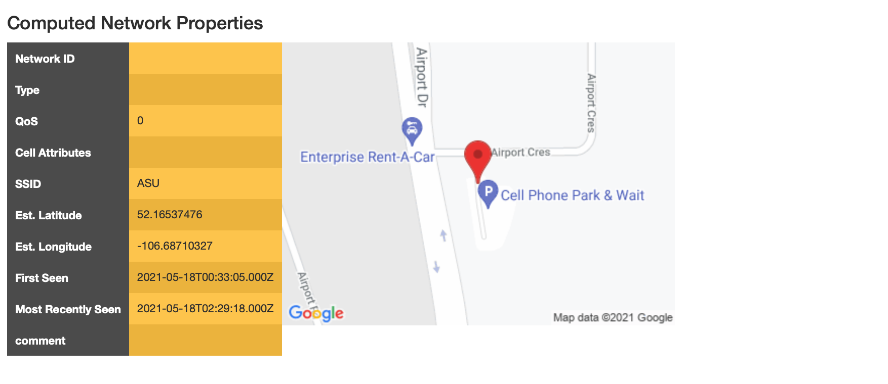
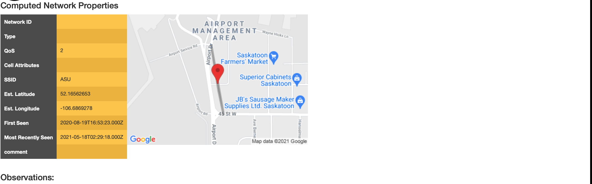
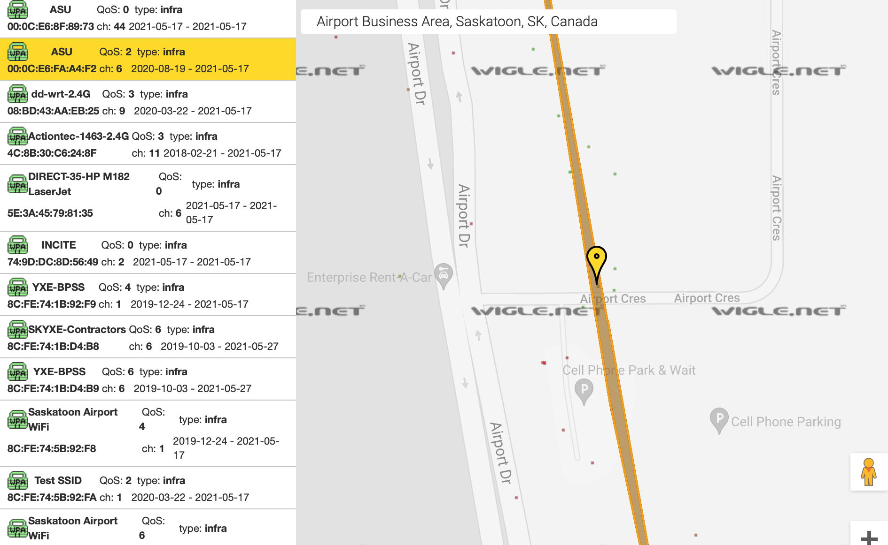
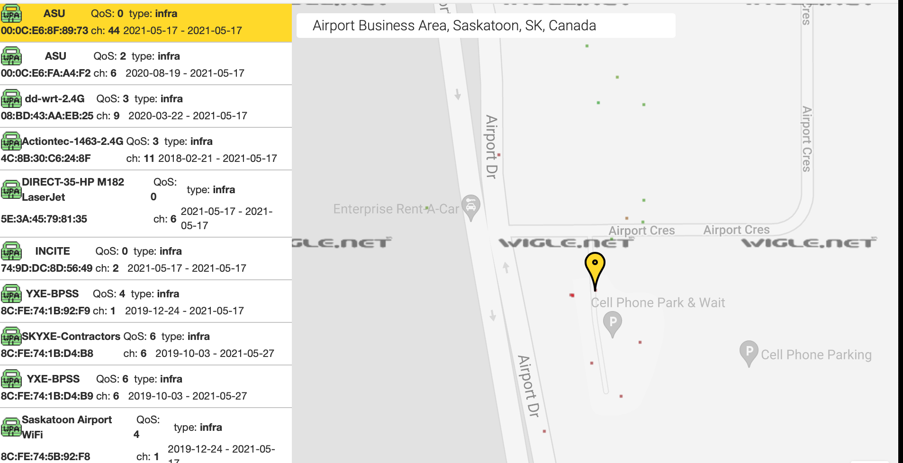

# SPS-ASU-OSINT

OSINT Related to Saskatoon Police’s Air Support Unit

| Aircraft Information                                                                          |
|--------------------------------------------------------------------------------------------------|
| **Mark:** C-FSPS                                                                                    |
| **Common Name:** Cessnai                                                                            |
| **Model Name:** 182T                                                                                |
| **Serial No.:** 18282424                                                                            |
| **Basis for Eligibility for Registration:** CAR Standard 507.02, 507.03 - Type Certificate - A204   |
| **Category:** Aeroplane                                                                             |
| **Engine:** 1, Piston                                                                               |
| **Max Take-Off Weight:** 1406.14 kg                                                                 |
| **24 Bit Address:** Bin=110000000011000100100001, Octal=60030441, Hex=C03121                        |
| **Regional Office:** Winnipeg                                                                       |
| **Year Imported:** 2018                                                                             |
| **Base of Operations:** Saskatoon, Saskatchewan, CANADA                                             |
| **Manufacturer:** Cessna Manufactured by Textron Aviation Inc.                                      |
| **Country of Manufacture:** U.S.A.Year of Manufacture:** 2016                                        |
| **Type of Registration:** State                                                                     |
| **Owner Registered Since:** 2018-04-10                                                              |
| **Latest Certificate of Registration Issued:** 2018-04-10                                           |
| **Registered Owner Information                                                                     |
| **Name:** Saskatoon Board of Police Commissioners                                                   |
| **Address:** P.O. Box 1728                                                                          |
| **City:** Saskatoon                                                                                 |
| **Postal Code:** S7K 3R6                                                                            |
| **Province/Territory/State:** Saskatchewan
| **Country:** CANADA                                                                                 |
| **Region:** Prairie and Northern                                                                    |
| **Mail Recipient:** Yes                                                                             |

[source](https://wwwapps.tc.gc.ca/Saf-Sec-Sur/2/CCARCS-RIACC/ADet.aspx?id=531479&rfr=RchSimp.aspx])

## Hardware 

### Wescam Generation 3 MX-10 with spotter scope, image blending and integrated with a Churchill navigation map system.

## Unrestricted flight position and coordainaetsiflight data feeds

Historical or live flight position data ann be found at [adsbexchagei](https://globe.adsbexchange.com/?icao=c03121)]

## LTE Hotspot

They apparently have a LTE hotspot on board which I want to caputre some passie AP reqest broadcast frames from in flight from the ground to confirm this which requires a parabolic antenna but until then since we know where they start and land and likely store the plane we can look at wigle.net networks around the areas they are not in the air as they taxi to and from the runway according to ASDBExcaange flight dat. There are two ways to approach this, eiter querying wigle.net for the small region that they taxi to and from along daily or maybe they set the LTE Hotspot SSID so it has he letters ASU in it? to the name ASU hotspot ASU If we limit the scope of a wigle search to this area here is a small blip of Wigle.net network data that is in the area they operate the plane out of.

Turns out both emthods worked. 

| Map | Net ID            | SSID | Name | Type  | First Seen               | Most Recently            | Crypto | Est. Lat    | Est. Long     | Channel | Bcn Int. | QoS | Found by Me | Free | Pay | Comment |   |
|-----|-------------------|------|------|-------|--------------------------|--------------------------|--------|-------------|---------------|---------|----------|-----|-------------|------|-----|---------|---|
| map | 00:0C:E6:8F:89:73 | ASU  |      | infra | 2021-05-17T17:00:00.000Z | 2021-05-17T19:00:00.000Z | #      | 52.16537476 | -106.68710327 | 44      | 0        | 0   |             |      |     |         |   |
| map | 00:0C:E6:FA:A4:F2 | ASU  |      | infra | 2020-08-19T09:00:00.000Z | 2021-05-17T19:00:00.000Z | #      | 52.16562653 | -106.6869278  | 6       | 0        | 2   |             |      |     |         |   |
| map | 42:06:04:9F:34:EB | ASU  |      | infra | 2018-11-30T22:00:00.000Z | 2018-12-08T22:00:00.000Z | #      | 52.13396835 | -106.66700745 | 6       | 0        | 0   |             |      |     |         |   |

#TODO 

Capture live packets as they fly around to  confirm their hotspot name and hardware manufacu 
